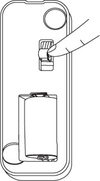
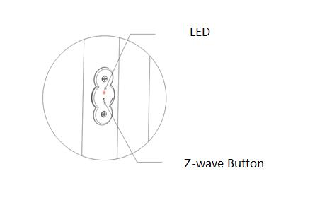

Aeotec based device 
======================

Please note that the following devices should be waken up before do configuration  

Door and Window Sensor  
--------------------------

Wake-up device 
~~~~~~~~~~~~~~~~~~

The Aeotec D/W Sensor can be made to stay awake for 10 minutes by pressing the tamper switch for 3 times. Once the Aeotec D/W Sensor has been woken, the LED will blink every few seconds indicating that it is now awake and ready to receive Z-Wave network information and instructions.

.. list-table:: Door and Window Sensor 
   :widths: 15 30
   :header-rows: 1

   * - Signal Trigger Device
     - Basic Set Value 
   * - ON 
     - Open: FF. Close: 00
   * - OFF 
     - Open: 00. Close: FF

.. list-table:: Value Trigger Controller 
    :widths: 15 30
    :header-rows: 1

    * - Value
      - Binary Report 
    * - 0x00
      - Open: FF. Close: 00
    * - 0xFF
      - Open: 00. Close: FF

Recessed Door Sensor  
-----------------------

Wake-up device 
~~~~~~~~~~~~~~~

The Aeotec Recessed Door Sensor can be made to stay awake for 10 seconds by pressing the z-wave button for 6 seconds.

.. list-table:: Basic Set Report 
   :widths: 15 30
   :header-rows: 1

   * - Value 
     - Basic Set Report 
   * - ON 
     - Open: FF. Close: 00
   * - OFF 
     - Open: 00. Close: FF

.. list-table:: Which Report 
   :widths: 15 30
   :header-rows: 1

   * - Value 
     - Binary Report  
   * - Binary, Basic 
     - Send Binary and Basic Set Report 
   * - Binary 
     - Send Binary Report 
   * - Basic  
     - Send Basic Report 
   * - Nothing
     - Send neither Basic Set nor Binary Report 

