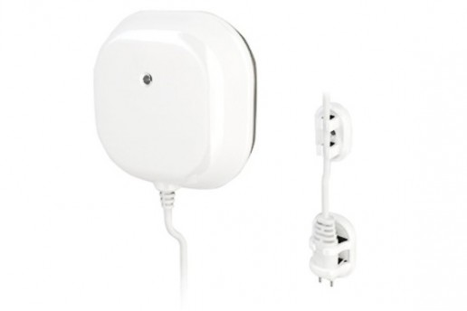
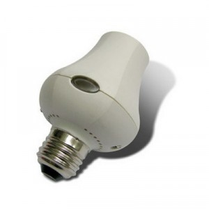

EverSpring 
===========

.. _everspring_flood_sensor:

Flood Sensor
---------------------------

Configuration   
~~~~~~~~~~~~~~~~

When a flooding event is detected, the device will send a Basic Set command. 
Then value of Basic Set is from 0 to 99.  

.. list-table::  
   :widths: 15 30
   :header-rows: 1

   * - Dimming value 
     - Description    
   * - 0 to 99   
     - Indicate the dimming level when a flooding event is detected  

.. _everspring_lamp_holder_sensor:

Everspring Lamp Holder
-----------------------

Configuration   
~~~~~~~~~~~~~~~~
There is no configuration 
