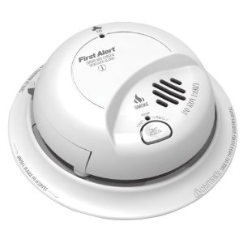

First Alert
======================

.. _first_alert_smoke_carbon_monoxide:

Smoke and Carbon monoxide
---------------------------

Configuration   
~~~~~~~~~~~~~~~~

The following table is to configure the number of Alarm message when either smoke or carbon monoxide is detected  

.. list-table::  
   :widths: 15 30
   :header-rows: 1

   * - Alarm Message
     - Description    
   * - One  
     - When either smoke or carbon monoxide is detected, one Alarm message is sent 
   * - Two  
     - When either smoke or carbon monoxide is detected, two Alarm messages are sent 
