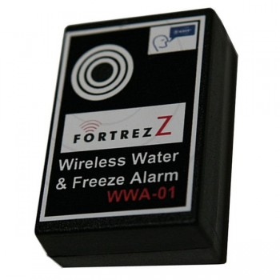

Fortrezz 
===========

.. _fortrezz_water_detector:

Fortrezz Water Detector 
---------------------------

Configuration   
~~~~~~~~~~~~~~~~

The sensor sends Alarm Report when either the temperature drops below a low threshold or rises above a high threshold.

The following table is to configure the low and high threshold of temperature for triggering the Alarm report 

.. list-table::  
   :widths: 15 30
   :header-rows: 1

   * - Low threshold of temperature 
     - Description    
   * - One  
     - When either smoke or carbon monoxide is detected, one Alarm message is sent 
   * - Two  
     - When either smoke or carbon monoxide is detected, two Alarm messages are sent 
