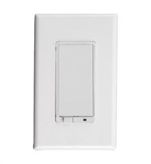
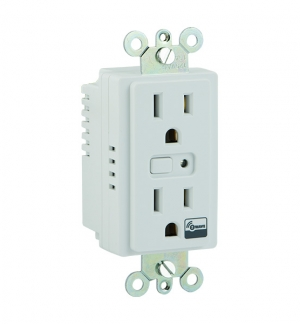

GE devices
===========

Plugin smart Dimmer/in-wall smart switch/in-wall smart outlet  
--------------------------------------------------------------

..   :align: center

Smart Switch 

.. image:: ../_static/images/GE_smart_dimmer.jpg
..   :align: center

Smart Dimmer 

..   :align: center

Smart outlet 

Configuration  
~~~~~~~~~~~~~~~
By default, the LED on the device is set to ON when the device is turned OFF. This LED allows to indicate the switch’s location in a dark room. To make the LED be ON when the device is turned OFF, change parameter 3’s value to “1”.

.. list-table:: 
   :widths: 15 30
   :header-rows: 1

   * - LED light 
     - Description   
   * - OFF
     - The LED is ON when device is turn OFF    
   * - ON
     - The LED is ON when device is turn ON

