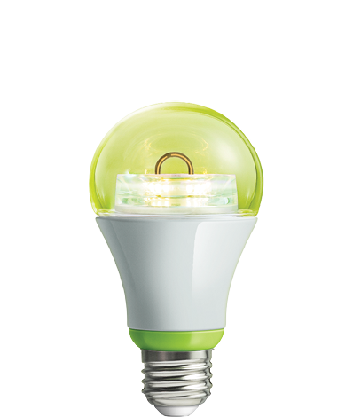

GE 
===========

.. _GE_config_device:

Plugin smart Dimmer/in-wall smart switch/in-wall smart outlet  
--------------------------------------------------------------

.. image:: ../_static/images/GE_smart_switch.jpg
..   :align: center

Smart Dimmer

.. .. image:: ../_static/images/GE_smart_dimmer.jpg
.. ..   :align: center

.. Smart Dimmer 

.. image:: ../_static/images/GE_smart_outlet.jpg
..   :align: center

Smart outlet 

Configuration  
~~~~~~~~~~~~~~~
By default, the LED on the device is set to ON when the device is turned OFF. This LED allows to indicate the switch’s location in a dark room. To make the LED be ON when the device is turned OFF, change parameter 3’s value to “1”.

.. list-table:: 
   :widths: 15 30
   :header-rows: 1

   * - LED indicator
     - Description   
   * - checked 
     - The LED is ON when device is turn OFF    
   * - unchecked 
     - The LED is ON when device is turn ON

.. _GE_config_outdoor_smart_switch:

Outdoor Smart Switch 
----------------------

.. Zigbee device 
.. _GE_zigbee_light_bulb:

GE Link LED LightBulb
----------------------------

