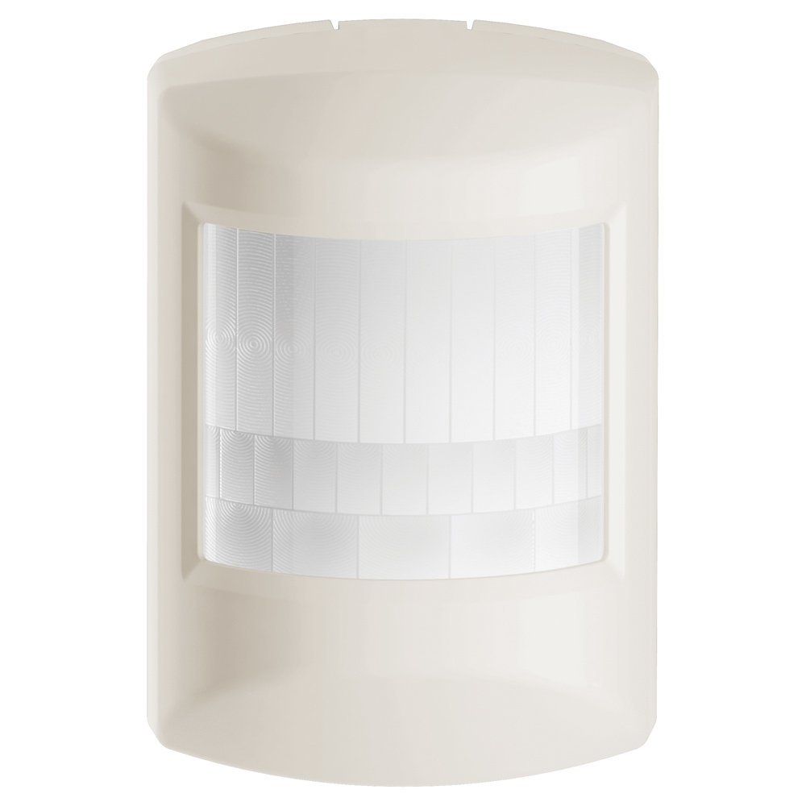

Schlage Based Device
======================

Door Lock  
-----------

Configuration  
~~~~~~~~~~~~~~~

.. list-table:: 
   :widths: 15 30
   :header-rows: 1

   * - BEEPER 
     - Description   
   * - ON  
     - Enable beep when a key is pressed 
   * - OFF 
     - disable beep when a key is pressed  

.. list-table:: 
   :widths: 15 30
   :header-rows: 1

   * - VACATION MODE 
     - Description   
   * - ON  
     - Enable vacation mode 
   * - OFF 
     - Disable vacation mode 

.. Press Schlage button, it is automatically locked 

.. list-table::  
   :widths: 15 30
   :header-rows: 1

   * - LOCK AND LEAVE 
     - Description   
   * - ON  
     - Enable lock and leave 
   * - OFF 
     - Disable lock and leave 

.. It is automaitcally lock after a mount of time is eslapsed 
.. list-table::  
   :widths: 15 30
   :header-rows: 1

   * - AUTOLOCK 
     - Description   
   * - ON  
     - Send Binary and Basic Set Report 
   * - OFF 
     - Send Binary Report 

.. 
.. list-table:: 
   :widths: 15 30
   :header-rows: 1

   * - LENGTH OF PASSCODE 
     - Description
   * - 4, 5, 6, 7, 8   
     - Set the corresponding length of passcode to door and lock

Door and Window Sensor 
---------------------------

Wake-up device 
~~~~~~~~~~~~~~~
This device is waken by triggering open/close event of this device

Configuration  
~~~~~~~~~~~~~~~

Association group two is intended for any device that is controllable with a Basic Set of 0xFF such as lights, sirens, or chimes. When a Door Window sensor is faulted, it will always send a Basic Set of 0xFF to all nodes associated to group two. When the Door Window sensor is restored, it is configurable if the Basic Set of 0x00 is sent to all nodes associated to group two. The following table shows the configuration

.. list-table:: 
   :widths: 15 30
   :header-rows: 1

   * - Signal Trigger Device
     - Basic Set Report    
   * - ON 
     - Basic Set Report 00 is sent when it is restored  
   * - OFF 
     - Basic Set Report 00 is NOT sent when it is restored

Motion Detector 
------------------

Wake-up device 
~~~~~~~~~~~~~~~
This device is waken by triggering motion 

Configuration  
~~~~~~~~~~~~~~~

Association group two is intended for any device that is controllable with a Basic Set of 0xFF such as lights, sirens, or chimes. When a Motion sensor is faulted, it will always send a Basic Set of 0xFF to all nodes associated to group two. When the Motion sensor is restored, it is configurable if the Basic Set of 0x00 is sent to all nodes associated to group two. The following table shows the configuration

.. list-table:: 
   :widths: 15 30
   :header-rows: 1

   * - Signal Trigger Device
     - Value
   * - ON  
     - Basic Set of 0X00 is sent when it is restored 
   * - OFF 
     - Basic Set of 0X00 is NOT sent when it is restored  

